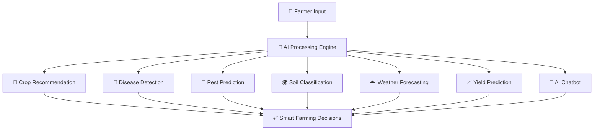

# AI-Precision-Farming-System
An intelligent precision agriculture system that uses machine learning to provide crop recommendation, yield prediction, weather insights, leaf disease detection, fertilizer advice, and an AI chat and voice assistant through an interactive Streamlit dashboard.

<div align="center">


<br>


<br><br>


<br><br>


<br><br>

# 🌾 KRISHISAKHI  

### 🚀 AI-POWERED SMART AGRICULTURE ASSISTANT  

<br>

> ## 🌍 Revolutionizing Agriculture Through Artificial Intelligence  
> ## 🚜 Building the Future of Sustainable Digital Farming  

<br>


</div>
## ⚡ Transforming Traditional Farming into Intelligent Digital Agriculture ⚡

</div>
# 🚀 Overview  

KrishiSakhi is an advanced AI-driven smart agriculture platform designed to transform traditional farming using Artificial Intelligence, Machine Learning, Deep Learning, and Real-Time Analytics.

The platform helps farmers make intelligent farming decisions through:

- 🌱 AI Crop Recommendation
- 🍃 Leaf Disease Detection
- 🐛 Pest Prediction
- 🌍 Soil Type Prediction
- ☁️ Weather Forecasting
- 📈 Yield Prediction
- 🤖 AI Chatbot Assistance
- 🌐 Multilingual Support

KrishiSakhi acts as a complete digital farming ecosystem that improves productivity, reduces crop loss, and promotes sustainable agriculture.

---

# ✨ Features  

## 🌱 AI Crop Recommendation
Get intelligent crop suggestions based on:

- Nitrogen (N)
- Phosphorus (P)
- Potassium (K)
- Temperature
- Humidity
- pH Level
- Rainfall

### Outputs:
- Recommended Crop
- Irrigation Suggestions
- Suitable Farming Conditions
- Disease Information

---

## 🍃 Leaf Disease Detection

Upload crop leaf images and the AI model will:

- Detect plant diseases
- Analyze infection severity
- Suggest treatments
- Recommend prevention methods

Powered by Deep Learning and Computer Vision.

---

## 🐛 Pest Prediction

Detect harmful pests from crop images using Vision AI.

### Features:
- Pest Identification
- Prevention Suggestions
- Crop Protection Guidance

---

## 🌍 Soil Type Prediction

AI-powered soil classification system capable of detecting:

- Alluvial Soil
- Black Soil
- Clay Soil
- Red Soil
- Laterite Soil

Helps farmers choose suitable crops for better productivity.

---

## ☁️ Real-Time Weather Forecasting

Provides live weather intelligence including:

- Temperature Forecast
- Humidity Analysis
- Rainfall Prediction
- Wind Information
- Real-Time Weather Updates

---

## 📈 Yield Prediction & Analytics

Machine Learning based agricultural analytics system.

### Predicts:
- Crop Yield
- Production Estimation
- Profit Analysis
- Market Value
- Resource Optimization

---

## 🤖 AI Chatbot Assistant

Smart AI assistant for farmers providing:

- Crop Guidance
- Farming Recommendations
- Disease Queries
- Real-Time Support
- Smart Agricultural Advice

---

## 🌐 Multilingual Support

Supports multiple Indian regional languages to remove language barriers and make technology accessible for all farmers.

---

## 📱 Additional Smart Features

- 📢 Community Forum
- ⏰ SMS Reminder System
- 📚 Crop Guidance
- 🌍 Multi-language Translator
- 🤝 Farmer Interaction Platform

---

# 🧠 Why KrishiSakhi is Innovative?  

✅ Multiple AI models integrated into one platform  
✅ Real-time farming intelligence  
✅ AI-powered disease & soil detection  
✅ Smart yield and market analysis  
✅ Farmer-friendly user interface  
✅ Regional language accessibility  
✅ Sustainable agriculture support  
✅ Data-driven farming ecosystem  

---

# 🏗️ System Architecture  

KrishiSakhi follows a scalable **3-Tier Architecture**.

## 1️⃣ Presentation Layer
- Streamlit Frontend
- Interactive Dashboard
- User-Friendly Interface

## 2️⃣ Application Layer
- Machine Learning Models
- Deep Learning Models
- AI Processing Modules
- Computer Vision Systems

## 3️⃣ Data Layer
- MongoDB Database
- User Data Management
- Prediction Storage
- Analytics Storage

---

# 🛠️ TECHNOLOGY STACK OF KRISHISAKHI 🚀  

<div align="center">

# 🌾 KRISHISAKHI  
### AI-Powered Smart Agriculture Ecosystem  


</div>

---

# ⚡ Core Technologies Behind KrishiSakhi  

<table>
<tr>
<td align="center" width="250">

## 🧠 AI & MACHINE LEARNING  


### Technologies
- TensorFlow
- Keras
- PyTorch
- Scikit-learn
- Transformers

### Powers
✅ Crop Recommendation  
✅ Disease Detection  
✅ Yield Prediction  
✅ AI Chatbot  
✅ Smart Analytics  

</td>

<td align="center" width="250">

## 👁️ COMPUTER VISION  


### Technologies
- OpenCV
- CNN Models
- Deep Learning

### Powers
✅ Leaf Disease Detection  
✅ Pest Prediction  
✅ Soil Classification  
✅ Image Analysis  

</td>

<td align="center" width="250">

## ☁️ CLOUD & APIs  


### APIs Used
- OpenWeatherMap API
- Google Translator API

### Powers
✅ Weather Forecasting  
✅ Multilingual Support  
✅ Real-Time Updates  
✅ Smart Recommendations  

</td>
</tr>
</table>

---

# 🌐 FRONTEND TECHNOLOGIES  

<div align="center">


</div>

<table>
<tr>
<td align="center">

### 🎨 Streamlit
Modern AI dashboard for interactive farming assistance.

</td>

<td align="center">

### 🌍 HTML5 & CSS3
Responsive and clean user interface design.

</td>

<td align="center">

### ⚡ Python Backend
Handles AI logic, predictions, APIs, and data processing.

</td>
</tr>
</table>

---

# 🗄️ DATABASE & DATA PROCESSING  

<div align="center">


</div>

<table>
<tr>
<td align="center">

## 🍃 MongoDB

Smart NoSQL database system for:

✅ User Management  
✅ Prediction Storage  
✅ Analytics Tracking  
✅ Farming History  

</td>

<td align="center">

## 📊 Data Science Stack


### Libraries
- Pandas
- NumPy

### Used For
✅ Data Cleaning  
✅ Data Analysis  
✅ Feature Engineering  
✅ ML Processing  

</td>
</tr>
</table>

---

# 🚀 AI MODULE ARCHITECTURE  

<div align="center">



</div>

---

# ⚙️ DEVELOPMENT ENVIRONMENT  

<div align="center">


</div>

| Tool | Purpose |
|---|---|
| 🔧 VS Code | Development Environment |
| 🌐 GitHub | Version Control & Collaboration |

---

# 🌟 KRISHISAKHI INNOVATION STACK  

<div align="center">

| 🚀 Technology | 🌾 Purpose |
|---|---|
| Artificial Intelligence | Smart Farming Decisions |
| Machine Learning | Prediction Systems |
| Deep Learning | Disease Detection |
| Computer Vision | Image-Based Analysis |
| NLP | AI Chatbot Assistant |
| Real-Time APIs | Weather Intelligence |
| Data Analytics | Yield & Profit Analysis |
| Multilingual AI | Regional Language Support |

</div>

---

<div align="center">

# 🌾 SMART FARMING • AI AUTOMATION • SUSTAINABLE AGRICULTURE 🚜

### KrishiSakhi is not just an application.  
### It is a complete AI-powered digital farming ecosystem.

</div>

# 📂 Project Structure  

```bash
KrishiSakhi/
│
├── app.py
├── requirements.txt
├── README.md
│
├── models/
│   ├── crop_recommendation.pkl
│   ├── yield_prediction.pkl
│   ├── disease_detection_model.h5
│   └── soil_prediction_model.h5
│
├── datasets/
│
├── assets/
│
├── modules/
│   ├── crop_recommendation/
│   ├── disease_detection/
│   ├── pest_prediction/
│   ├── soil_prediction/
│   ├── weather_forecasting/
│   ├── yield_prediction/
│   ├── chatbot/
│   └── translator/
│
└── database/
```

---

# ⚡ Installation Guide  

## 1️⃣ Clone the Repository

```bash
git clone https://github.com/your-username/KrishiSakhi.git
```

---

## 2️⃣ Navigate to Project Directory

```bash
cd KrishiSakhi
```

---

## 3️⃣ Create Virtual Environment

### Windows
```bash
python -m venv venv
venv\Scripts\activate
```

### Linux / Mac
```bash
python3 -m venv venv
source venv/bin/activate
```

---

## 4️⃣ Install Dependencies

```bash
pip install -r requirements.txt
```

---

## 5️⃣ Run the Application

```bash
streamlit run app.py
```

---

# 📊 Workflow  

```text
User Input
     ↓
Data Preprocessing
     ↓
AI / ML Models
     ↓
Prediction & Analysis
     ↓
Smart Recommendations
     ↓
Better Farming Decisions
```

---

# 🌍 Real-World Impact  

KrishiSakhi helps farmers by:

- Increasing farming productivity
- Reducing crop loss
- Early disease detection
- Improving crop selection
- Supporting smart farming
- Encouraging sustainable agriculture
- Reducing dependency on traditional guesswork

---

# 🔮 Future Scope  

Future enhancements planned:

- 📡 IoT Soil Moisture Monitoring
- 🚁 Drone-Based Crop Monitoring
- 💧 Smart Irrigation Automation
- 📱 Mobile Application
- 🛰️ Satellite-Based Crop Analysis
- 🌐 Offline Support for Rural Areas
- 🏛️ Government Agriculture Scheme Integration
- 📈 Advanced AI Analytics

---

# 📸 Screenshots  

## 🌱 Crop Recommendation
(Add Screenshot Here)

## 🍃 Disease Detection
(Add Screenshot Here)

## 🌍 Soil Prediction
(Add Screenshot Here)

## 📈 Yield Prediction
(Add Screenshot Here)

## 🤖 AI Chatbot
(Add Screenshot Here)

---

# 🤝 Contributing  

Contributions are welcome!

If you would like to contribute:

1. Fork the repository
2. Create a new branch
3. Make your changes
4. Commit your changes
5. Push to your branch
6. Create a Pull Request

---

# 👨‍💻 Team  

### Developed By

- Rupsha Biswas
- Sayan Das
---

# 📜 License  

This project is licensed under the MIT License.

---

# 🌟 Final Vision  

> Building a complete AI-powered digital ecosystem for modern agriculture.

KrishiSakhi is not just a project.  
It is a vision to empower farmers with technology, intelligence, and sustainable farming solutions.

---

# ⭐ Support  

If you like this project:

⭐ Star this repository  
🍴 Fork this project  
📢 Share with others  

---

# 🙏 Thank You  

### Smart Farming Begins Here 🌾🚜✨
